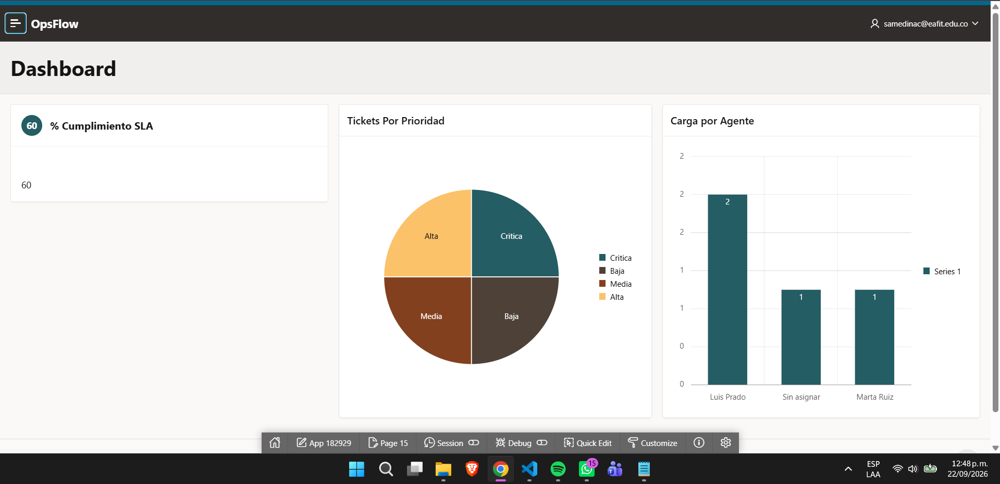
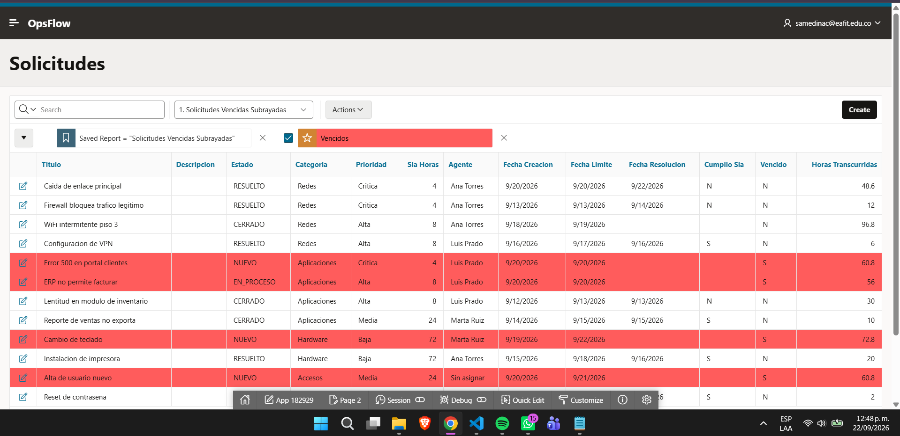
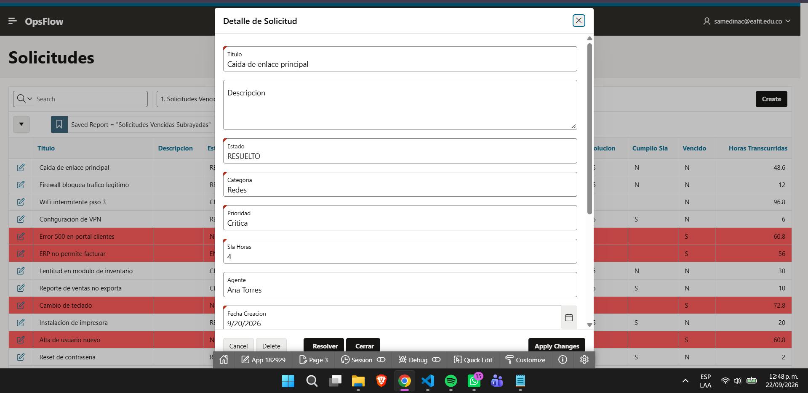
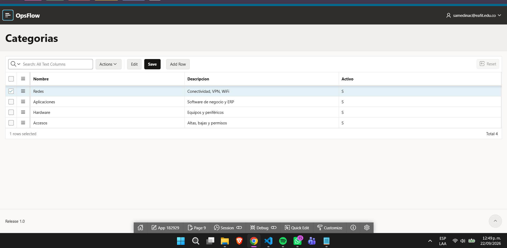

# OpsFlow — Portal de Gestión y Métricas de Servicios

Aplicación web empresarial **low-code** construida con **Oracle APEX**, **SQL** y **PL/SQL**
para centralizar solicitudes operativas (tickets), automatizar el cálculo de cumplimiento de
**SLA** y exponer un panel de **métricas de proceso**.

> Proyecto personal desarrollado como demostración de competencias en Oracle APEX,
> modelado de datos relacional, lógica de negocio en PL/SQL y QA.

---

##  Qué demuestra este proyecto

- **Modelado de datos relacional:** diagrama ER, diccionario de datos, integridad referencial.
- **SQL + PL/SQL:** *packages*, *triggers*, funciones, vistas de métricas.
- **Automatización de reglas de negocio:** cálculo de fecha límite por SLA, auditoría de estados.
- **Analítica de procesos:** dashboard con KPIs y gráficos.
- **QA:** casos de prueba unitarios (script PL/SQL) y funcionales documentados.
- **Buenas prácticas:** scripts idempotentes y versionados, decisiones técnicas documentadas.

##  Arquitectura

```
Oracle APEX (UI: reportes, formularios modales, dashboard)
        │  SELECT / procesos de página
        ▼
Vistas de métricas  ──►  Package PL/SQL (reglas)  ──►  Triggers (auditoría/SLA)
        │                                                     │
        └──────────────►  Tablas relacionales  ◄─────────────┘
```

##  Estructura del repositorio

```
opsflow/
├── README.md                      ← este archivo
├── database/
│   ├── install_all.sql            ← instala todo en orden
│   ├── 01_schema/                 ← tablas, constraints, índices (DDL)
│   ├── 02_logic/                  ← package, triggers, vistas (PL/SQL)
│   ├── 03_seed/                   ← datos de ejemplo
│   └── 04_tests/                  ← pruebas de la lógica de negocio
├── docs/
│   ├── 01_alcance_y_diseno.md     ← alcance, ER, diccionario de datos
│   ├── 02_casos_de_prueba.md      ← QA: casos unitarios y funcionales
│   ├── 03_decisiones_tecnicas.md  ← por qué de cada decisión
│   └── capturas/                  ← screenshots de la app
└── apex/                          ← export de la app APEX (.sql)
```

##  Modelo de datos

Cinco entidades: `OPS_CATEGORIA`, `OPS_PRIORIDAD`, `OPS_AGENTE`, `OPS_TICKET` y
`OPS_TICKET_HISTORIAL`. Detalle completo (diagrama + diccionario) en
[`docs/01_alcance_y_diseno.md`](docs/01_alcance_y_diseno.md).

## Pruebas

- Unitarias (PL/SQL): `database/04_tests/01_pruebas_logica.sql` — 5 casos (CP-01…CP-05).
- Funcionales (APEX): documentadas en [`docs/02_casos_de_prueba.md`](docs/02_casos_de_prueba.md).

## Stack

`Oracle APEX` · `Oracle Database 19c+` · `SQL` · `PL/SQL`

---

## Vistazo a la aplicación

### Dashboard de métricas
Panel con KPIs (tickets abiertos, % de cumplimiento de SLA, tiempo promedio de resolución)
y gráficos de tickets por prioridad y carga por agente.



### Gestión de solicitudes
Reporte interactivo con filtros, orden y exportación. Los tickets **vencidos** se resaltan
automáticamente mediante formato condicional.



### Detalle de solicitud
Formulario de alta/edición con botones **Resolver** y **Cerrar** que invocan la lógica de
negocio en PL/SQL (cálculo de SLA y auditoría automática de estados).



### Mantenimiento de catálogos
Edición en línea (Interactive Grid) de categorías, prioridades y agentes.



---

## → Puesta en marcha

**Opción A — Importar la app completa (más rápido):**
1. Creá un workspace gratuito en [apex.oracle.com](https://apex.oracle.com).
2. Ejecutá los scripts de `database/` en orden (o `install_all.sql`) para crear el esquema y los datos.
3. En **App Builder → Import**, subí `apex/f182929.sql` para restaurar la aplicación.

**Opción B — Solo la base de datos:**
En **SQL Workshop → SQL Scripts**, ejecutá los archivos de `database/` en orden y verificá con
`SELECT * FROM vw_dashboard_kpi;`.
